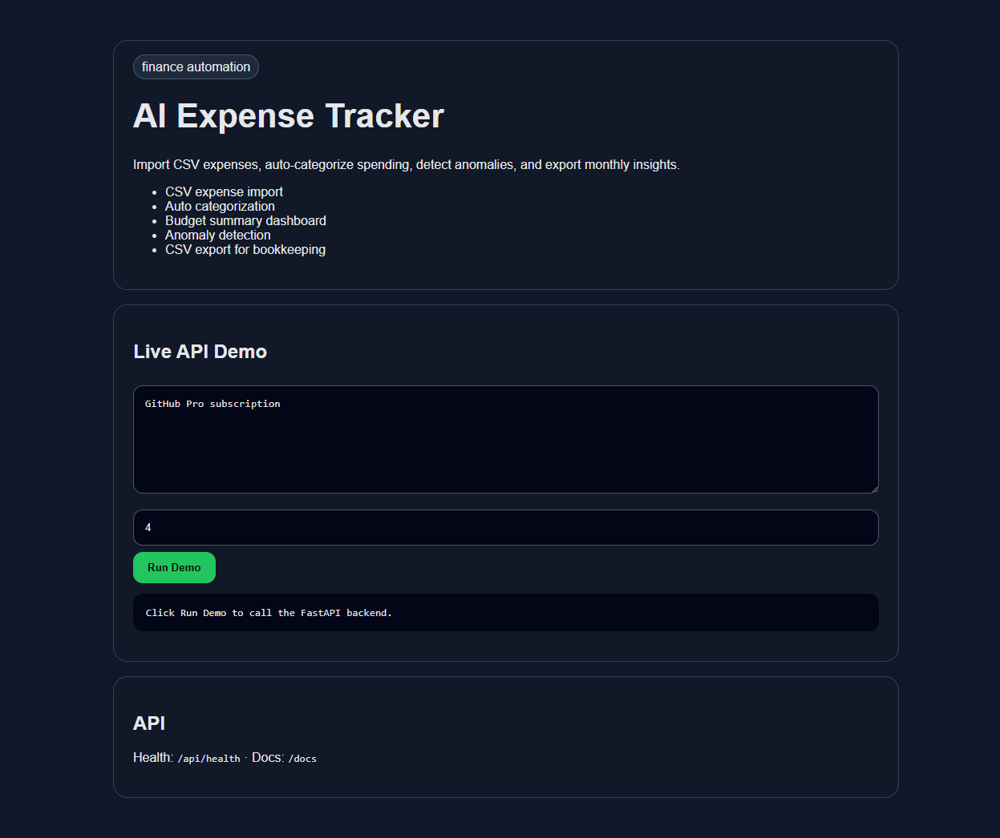

# AI Expense Tracker

    

Import CSV expenses, auto-categorize spending, detect anomalies, and export monthly insights.



## Why this project exists

This is a portfolio-ready MVP in the **finance automation** lane. It demonstrates practical API product thinking, clean documentation, tests, and a working local browser demo.

## Features

- CSV expense import
- Auto categorization
- Budget summary dashboard
- Anomaly detection
- CSV export for bookkeeping

## Tech Stack

- Python 3.11+
- FastAPI
- SQLite
- Vanilla HTML/CSS/JS frontend served by the API
- Pytest API tests

## Quick Start

```bash
uv sync
uv run uvicorn src.main:app --reload --port 8106
```

Then open: http://localhost:8106

Windows one-click launcher: `run.bat`

## API

- `GET /` - browser demo
- `GET /api/health` - health check
- `GET /docs` - interactive FastAPI docs

## Verification

```bash
uv run pytest -q
```

## Roadmap

- Add authenticated user accounts
- Add production deployment config
- Replace deterministic helper logic with local Ollama model calls where useful
- Add screenshots and a short demo GIF
